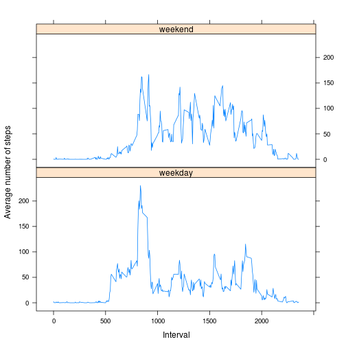

# Reproducible Research: Peer Assessment 1

This is an exploratory analysis of data collected from a personal activity monitoring device. The data is from an anonymous individual and was collected at 5 minute intervals during the months of October and November 2012.

## Loading and preprocessing the data

Prior to data analysis, the script:  
  
1. Set the correct working directory (if script is reused, that line needs to be uncommented and set according to individual needs).  
2. Checked if the directory contained a zipped or unzipped version of the data. If neither were present, the zip-file was downloaded.  
3. Unzipped the file if it hadn't already been done.  
4. Read in the data.  


```r
#setwd("Documents/Learn/Online courses/DataScience/Reproducible research/week2/RepData_PeerAssessment1/")

url <- "https://d396qusza40orc.cloudfront.net/repdata%2Fdata%2Factivity.zip"

if (!file.exists("activity.zip") & !file.exists("activity.csv")) {
        download.file(url, destfile="activity.zip", method="curl")
}

if (!file.exists("activity.csv")){
        unzip("activity.zip")
}

act <- read.csv("activity.csv")
```

## What is mean total number of steps taken per day?

I first wanted to explore the variation in the number steps taken. Therefore, I created a histogram of the total number of steps taken each day:


```r
perDay <- tapply(act$steps, act$date, sum)
hist(perDay, breaks=10, xlab="Number of steps taken per day", 
     main="Daily activity")
```

 

Furthermore, I calculated the mean and median number of steps taken daily:


```r
mean(perDay, na.rm=T)
```

```
## [1] 10766
```

```r
median(perDay, na.rm=T)
```

```
## [1] 10765
```

## What is the average daily activity pattern?

Activity is expected to vary at different times of the day. To analyze this, I created a time series plot of the number of steps taken in each 5-minute interval, averaged across the two-month period.


```r
int <- aggregate(x = act$steps, by = list(act$interval), FUN = "mean", na.rm=T)
plot(int[,1], int[,2], type="l", main="Average daily activity pattern",
     xlab="Interval", ylab="Average number of steps")
```

 

The time-interval with the maximum average activity was:


```r
as.numeric(subset(int[,1], int[,2]==max(int[,2])))
```

```
## [1] 835
```

## Imputing missing values

The number of missing values in this data set was large:


```r
sum(is.na(act))
```

```
## [1] 2304
```

To see if the missing values could have a large influence on the data analysis, I created a new data set with the missing values changed to the mean of that 5-minute interval.


```r
n <- length(act[,1])
imputed <- vector()
length(imputed) <- n

for(i in 1:n) {
       if(is.na(act[i,1])) {
               imputed[i] <- subset(int[,2], int[,1]==act[i,3])
       } else {
               imputed[i] <- act[i,1]
       }
}

act[,1] <- imputed
```


Using this new data with imputed values, I created a new histogram and once more calculated the mean and median number of steps taken per day.


```r
perDay2 <- tapply(act$steps, act$date, sum)
hist(perDay2, breaks=10, xlab="Number of steps per day", 
     main="Daily activity, including imputed values")
```

 

```r
mean(perDay2)
```

```
## [1] 10766
```

```r
median(perDay2)
```

```
## [1] 10766
```

Compared to the original data, the new distribution of the number of steps per day changed slightly, but the mean and median were very similar to the data with missing values.

## Are there differences in activity patterns between weekdays and weekends?

Finally, to see if the activity pattern was different on weekends compared to the rest of the week, I created a new factor variable that indicated if the data was collected on a weekend or on a weekday. I then created time series plots of the average number of steps taken in each 5-minute interval, averaged across all weekend days or weekdays. The data used to create these plots included the imputed values.


```r
act[,2] <- as.Date(act[,2])
for(i in 1:n) {
       if(weekdays(act[i,"date"])=="Saturday"|weekdays(act[i,"date"])=="Sunday"){
               act[i,"Weekd"] <- "weekend"
       } else {
               act[i,"Weekd"] <- "weekday"
       }
}

int2 <- aggregate(x = act$steps, by = list(act$interval, act$Weekd), FUN = "mean")
colnames(int2) <- c("interval", "Weekd", "steps")

library(lattice)
xyplot(steps ~ interval | Weekd, data = int2, layout=c(1,2), xlab="Interval", 
       ylab="Number of steps", type="l")
```

 

The plots indicate that there may indeed be a difference between the actvity patterns in the weekends and during weekdays.
